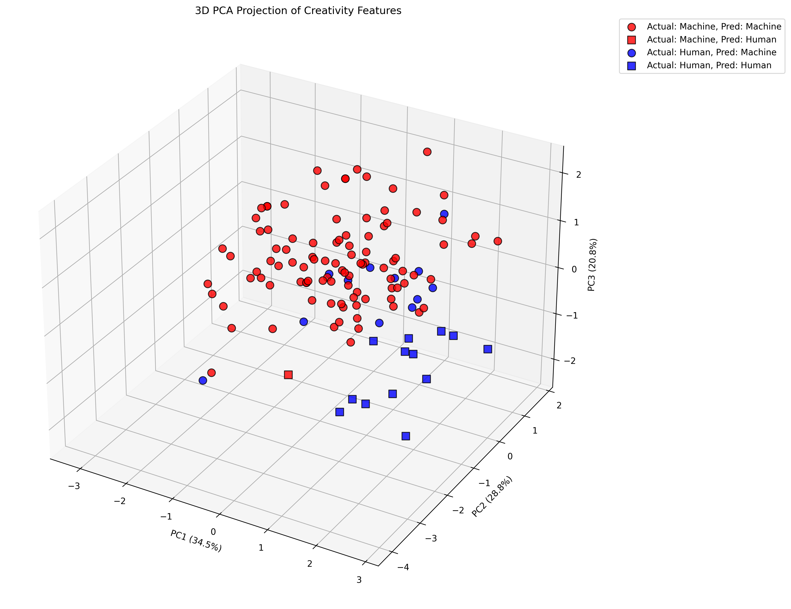
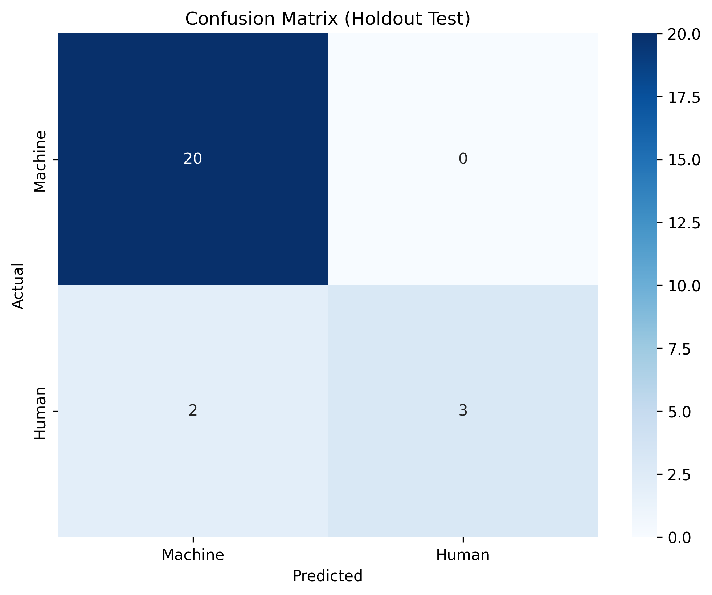

# Can Generative AI be Creative?

This repository contains the code, data, and results for the academic paper titled "The Creative Turing Test: Distinguishing Human and Machine Creativity in Conceptual Blending". The project aims to empirically investigate the nature of creativity in Large Language Models (LLMs) by comparing their outputs to a human baseline on a conceptual blending task.

## Overview

The core question of this research is: **Can generative AI be creative?**

To move beyond purely philosophical debate, we designed an experiment to quantify and compare different facets of creativity. We prompted several state-of-the-art LLMs and a group of humans to perform a conceptual blending task. The generated outputs were then evaluated on three key metrics derived from computational creativity literature:

- **Novelty**: How original is the concept compared to its sources?
- **Coherence**: How logical, well-formed, and meaningful is the concept?
- **Emergence**: Does the concept contain a surprising, non-obvious property? (Our proxy for transformational creativity).

Finally, we trained a machine learning classifier on these creativity-oriented features to determine if a quantitative "fingerprint" exists that can distinguish between human and machine-generated creative content.

## Repository Structure

The project is organized into the following directories and files:

```
.
├── blended_concepts_dataset/
│   ├── ... (raw outputs from each group)
├── dataset/
│   ├── concepts.csv
│   └── creativity_classification_dataset.csv
├── results/
│   ├── ... (scored datasets and generated figures)
├── .gitignore
├── LICENSE
├── prepare_binary_dataset.py
├── rating.py
├── README.md
├── scores_summary.py
└── train_and_eval_model.py
```

### Directory Descriptions

- **`/blended_concepts_dataset`**: Contains the raw .csv files with the generated blended concepts from each participant group (LLMs and humans). This is the starting point for the data processing pipeline.

- **`/dataset`**: Holds the initial list of concept pairs (`concepts.csv`) used to prompt participants, and the final, aggregated dataset (`creativity_classification_dataset.csv`) used for the classification task.

- **`/results`**: Stores the intermediate scored datasets after evaluation, and the final figures (`3d_pca_projection.jpg`, `confusion_matrix.png`) generated by the analysis scripts.

### Script Descriptions

- **`rating.py`**: A script that takes the raw generated concepts, calculates the Novelty score using Sentence-BERT embeddings and the Coherence score using a call to the Gemini API, then saves the new scored files.

- **`scores_summary.py`**: A utility script to parse the scored data files, calculate the average scores for each group, and print the summary table as seen in the paper.

- **`prepare_binary_dataset.py`**: This script aggregates all the individual scored files from the `/results` directory into a single, unified .csv file (`creativity_classification_dataset.csv`), adding the `human_generated` binary label for the classification task.

- **`train_and_eval_model.py`**: The main machine learning pipeline. It loads the final dataset, trains a logistic regression model to distinguish between human and AI outputs, evaluates its performance using cross-validation, and generates the final visualizations (PCA plot and confusion matrix).

## Experimental Workflow & How to Run

To reproduce the results, follow the steps below. Please note that all scripts assume that the .CSVs are located in the current directory.

### Prerequisites

Install the required Python libraries from the command line:

```bash
pip install pandas scikit-learn sentence-transformers google-generativeai matplotlib seaborn tqdm
```

### Execution Steps

#### 1. Generate Data (Manual Step)
The initial blended concepts in `/blended_concepts_dataset` were generated by prompting each model and the human participants with the concept pairs from `/dataset/concepts.csv`. This step is considered complete.

#### 2. Score Raw Data
Run the `rating.py` script to evaluate the raw blended concepts for Novelty and Coherence. This script reads files from `/blended_concepts_dataset` and saves the scored versions in `/results`.

**Note**: You must set your Google Gemini API key in `rating.py` for the Coherence scoring to work.

```bash
python rating.py
```

#### 3. Add Emergence Scores (Manual Step)
After running `rating.py`, the files in `/results` must be manually updated with the `emergence_score` column, as this was evaluated by a human rater. This step is considered complete for the existing data.

#### 4. Summarize Scores
To view the summary table of average scores (as seen in the paper), run:

```bash
python scores_summary.py
```

#### 5. Prepare the Classification Dataset
Combine all the scored data into a single file ready for the ML model:

```bash
python prepare_binary_dataset.py
```

This will create `creativity_classification_dataset.csv`.

#### 6. Train and Evaluate the Classifier
Finally, run the machine learning pipeline. This script will train the model, print the evaluation metrics to the console, and save the confusion matrix and PCA plot.

```bash
python train_and_eval_model.py
```

## Key Findings

- **Distinct Creative Profiles**: LLMs consistently outperform humans on Coherence, producing highly polished and logically sound concepts. Humans, however, score significantly higher on Emergence, indicating a greater capacity for surprising, non-obvious creative leaps.

- **A "Creative Fingerprint" Exists**: A logistic regression classifier can distinguish between human and machine-generated content with ~92% accuracy based on the creativity metrics alone. This suggests that the processes leave behind different, quantifiable signatures.

- **Failure of a "Creative Turing Test"**: The high degree of distinguishability implies that, at present, AI creativity is not indistinguishable from human creativity.

## Results Visualization

The following figures illustrate the key findings from our analysis:

### 3D PCA Projection


This 3D Principal Component Analysis projection shows how human and AI-generated concepts cluster differently in the creativity feature space, demonstrating the distinct creative signatures of each group.

### Classification Performance


The confusion matrix displays the performance of our logistic regression classifier in distinguishing between human and machine-generated creative content, achieving ~92% accuracy.

## Citation

If you use this work, please cite the accompanying paper:

```bibtex
@article{Marcello2025CreativeTuringTest,
  title={The Creative Turing Test: Distinguishing Human and Machine Creativity in Conceptual Blending},
  author={Marcello, Guilherme L.},
  year={2025}
}
```